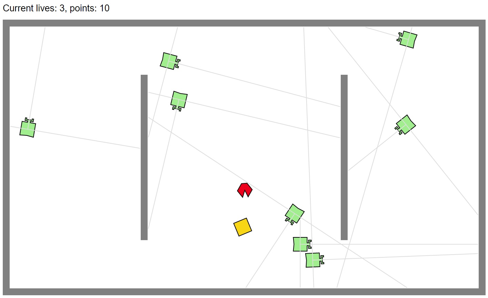

# EE520_FinalProject

# Overview
The goal of this project is to create a Pac-Man but with a little difference. Initially player will be created at the centor of a room with 5 lives, and there will be 2 ghosts walking in the room and try to catch the player. The player will have to collect as more golds as he/she can. By pressing `w`,`a`,`s`,`d`, the player will move accordingly. The ghost will automatically increase 1 for each 5 seconds. Also, when the player got a coin, the ghost will also increase 1.



# Challenges
When developing the program, I met some challenges. First of all, how to remove the multiple ghosts that we created when the game is finished? After several attempt, I let every created "ghost" to emit their id to an event. The "display" agent will constantly spying on this event, and remove those ghosts by id once the player has no more lives. Secondly, I didn't want to just make my ghost wander. In order to make the ghost walk in a certain pattern, I have to calculate the sensor result and decide which way to turn, and what kind of behavior should it act when it saw the player. Last of not least, syncing the global values is very tricky. Since every agent is working on a different thread, it's dangerous for them to manipulate the global variables. Instead, I update those global variables by emitting events.

# Installation

First, clone the git repo.
Second, start the docker image environment.
```
docker run -p80:80 -p8765:8765 -v $PWD/EE520_FinalProject:/source -it klavins/enviro:v1.6 bash
```
If this is the first time using this image file, this will automatically download the environment.

# Run the Simulation
After the docker was turn on, we execute the following steps.
```
esm start
make
enviro
```
This will start the the simulation. To view the simulation, please open a web browser and type in http://localhost/

# Code
There are 4 agents in this project: display, ghost, gold, and player. 
1. display: The main goal is to keep update current points and remained lives. 
2. ghost: The main goal is to catch player. The moving speed willincrease when it saw the user. 
3. gold: It is the target that player should go after with. Player will gain points once it reach the gold.
4. player: User controls player to both avoid caught by ghost and also gain more points.

Also, there are some other files for specific usage.
1. styles.h: Record different type of styles, such as ghosts appearance or golds appearance.
2. parameters.h: Initialize the global variables such as lives, golds, and so on.

# Acknowledges
ENVIRO: The multi-agent, multi-user, multi-everything simulator
- https://github.com/klavinslab/enviro

Elma: An event loop manager for embedded systems 
- http://klavinslab.org/elma/